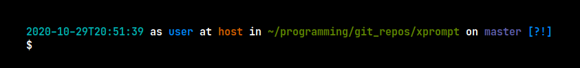

# xprompt

[](https://travis-ci.org/56quarters/xprompt)
[](https://crates.io/crates/xprompt/)

Display a colorful Bash prompt.

`xprompt` is a CLI tool for displaying something that can be used as a `PS1` or
`PS2` value for your Bash prompt.

## Install

xprompt is a Rust project. If you want to install it, you'll need the Rust
toolchain. For more information about how to install Rust see https://www.rustup.rs/

After you have Rust installed, you can use Cargo to install xprompt.

```
cargo install --force xprompt
xprompt --help
```

## Usage

To use `xprompt` to set your Bash prompt, add the following to your `.bashrc` or
`.bash_profile` files in your home directory. NOTE: `xprompt` must be available on
your `PATH` in order to work due to the specifics of how version control information
is generated.

```
export PS1="$(xprompt --ps1)"
export PS2="$(xprompt --ps2)"
```



That's all you need!

## Source

The source code is available on GitHub at https://github.com/56quarters/xprompt

## Changes

Release notes for xprompt can be found in the [CHANGES.md](CHANGES.md) file.

## Development

xprompt uses Cargo for performing various development tasks.

To build Staccato:

```
$ cargo build
```

To run tests:

```
$ cargo test
```

To run benchmarks:

```
$ cargo bench
```

To build documentation:

```
$ cargo doc
```

## License

xprompt is available under the terms of the [GPL, version 3](LICENSE).

### Contribution

Unless you explicitly state otherwise, any contribution intentionally submitted
for inclusion in the work by you shall be licensed as above, without any
additional terms or conditions.

## Credit

The style of this prompt is based on [Jess Fraz's](https://github.com/jessfraz/) Bash
[dot files](https://github.com/jessfraz/dotfiles/blob/663bc68ac49fe04d7a52ec410d3074d038dbe87f/.bash_prompt).